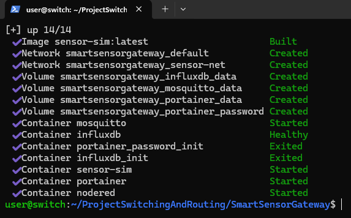
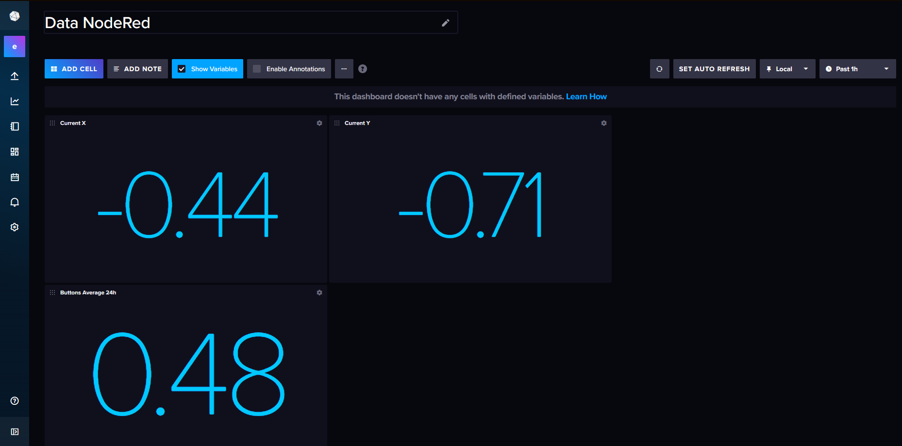
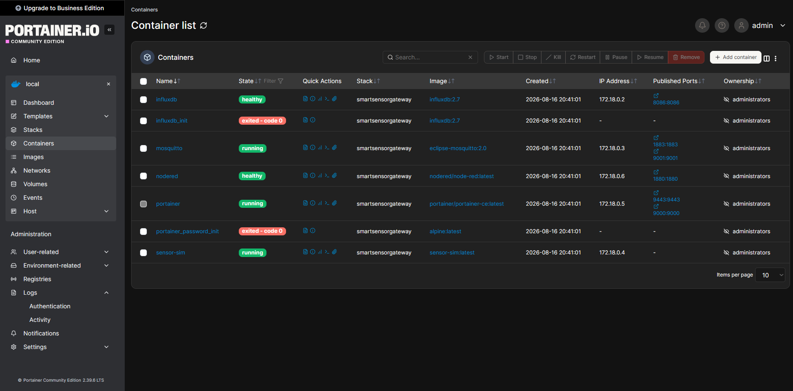

# Smart Sensor Gateway
Herwerking van Project Switching&Routing.

## Architecture

```
sensor_sim (Python) --MQTT--> mosquitto --MQTT--> nodered --HTTP--> influxdb
                                                                        ^
                                                              influxdb_init
                                                          (imports dashboard once,
                                                           on first successful boot)

portainer  <-- manages all of the above via the Docker socket
```

## Components
| Component | Role | Image |
|---|---|---|
| Mosquitto | MQTT broker, receives sensor updates | `eclipse-mosquitto:2.0` |
| Node-RED | Validates, formats, and routes messages to InfluxDB | `nodered/node-red:latest` |
| InfluxDB 2.x | Time-series storage for cleaned readings | `influxdb:2.7` |
| `influxdb_init` | One-shot service that imports the dashboard template on first boot | `influxdb:2.7` |
| `sensor_sim` | Python script simulating joystick + button sensor data | built from `./sensor-sim` |
| Portainer | Web UI for managing the Docker environment | `portainer/portainer-ce:latest` |
| `portainer_password_init` | One-shot service that seeds the Portainer admin password from `.env` | `alpine:latest` |

## Data flow
1. `sensor_sim` publishes simulated joystick and button readings to Mosquitto.
2. Mosquitto forwards these messages to Node-RED.
3. Node-RED validates the payloads (range checks, type coercion) and formats them as InfluxDB line protocol.
4. Node-RED writes the data to InfluxDB via HTTP.
5. On first successful startup, `influxdb_init` applies `docker/influxdb/sensor_dashboard.yaml`, so the dashboard is ready in the InfluxDB UI without any manual steps.

## Prerequisites
- Docker and Docker Compose v2 installed
- Ports listed under **Quick start** below free on your host (or adjust them in `.env`)yay werkt deze keer :)

## Quick start

Download docker: curl -fsSL https://get.docker.com | sh

0. git clone https://github.com/JollyJones101/ProjectSwitchingAndRouting.git
1. Go to the project folder.
2. Make `.env` file (copy `exampleEnv` and fill in your own values — see **Security note** below).
3. Run:

```bash
docker compose --env-file .env up -d --build | of met sudo als je issues hebt
```

4. Open the following endpoints (see `.env` for current port mappings):
   - Node-RED: http://localhost:1880
   
   - Portainer: http://localhost:9000
   
   - InfluxDB: http://localhost:8086
   - Mosquitto MQTT: localhost:1883
   - Mosquitto WebSocket: http://localhost:9001


## Useful commands
```bash
docker compose logs -f
make up
make down
make rebuild
```

## Default credentials
> ⚠️ **Security note:** these are development defaults from `.env`. Never commit real credentials to version control, and change them before exposing this stack beyond your local machine.

- InfluxDB user: `edge`
- InfluxDB password: `123EdgeOps!`
- Portainer user: `admin` *(fixed — the username can't be changed via the automated `--admin-password-file` setup; rename it later in the Portainer UI if needed)*
- Portainer password: `EdgePortainer!2026`

## Project structure
```
.
├── docker-compose.yml
├── .env
├── docker/
│   ├── mosquitto.conf
│   ├── influxdb/
│   │   ├── sensor_dashboard.yaml   # InfluxDB dashboard template
│   │   └── apply_dashboard.sh      # substitutes env vars, then runs `influx apply`
│   └── nodered/                    # Node-RED flows, credentials, settings
└── sensor-sim/
    ├── sensor_sim.py
    ├── requirements.txt
    └── Dockerfile
```
