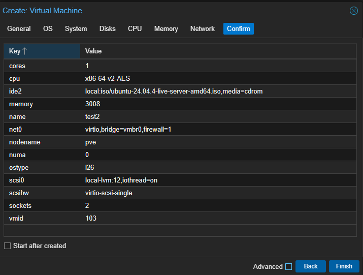
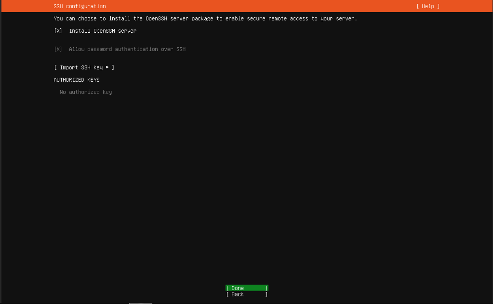
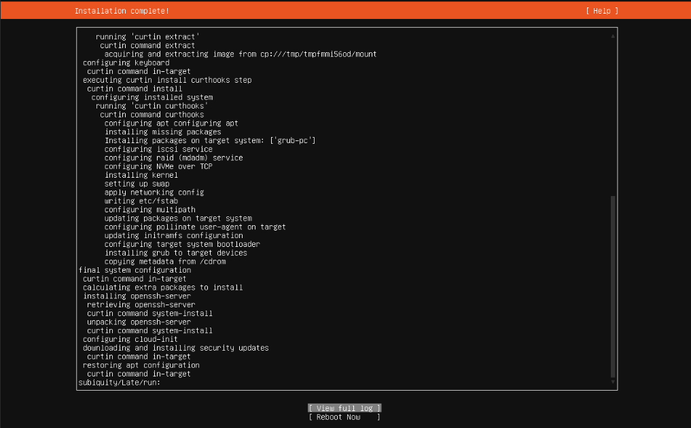
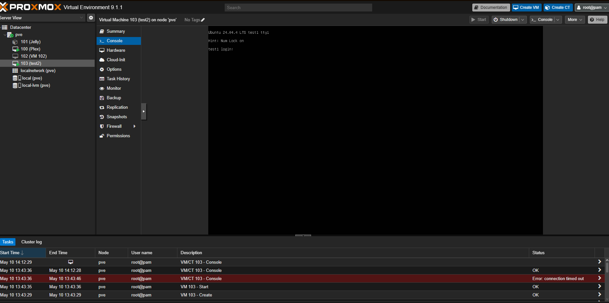
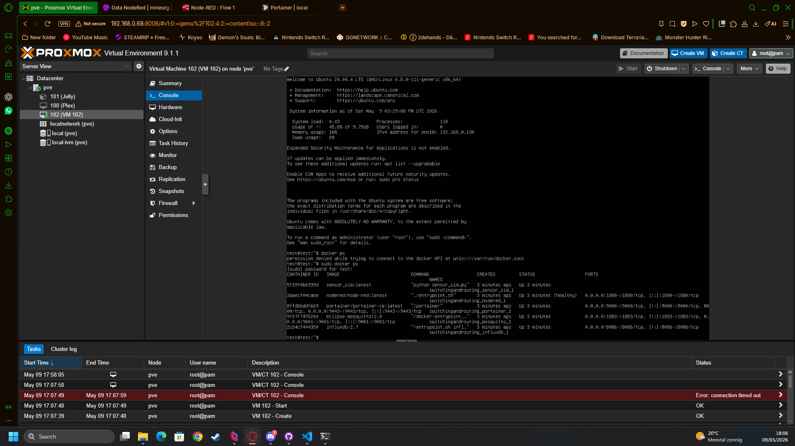
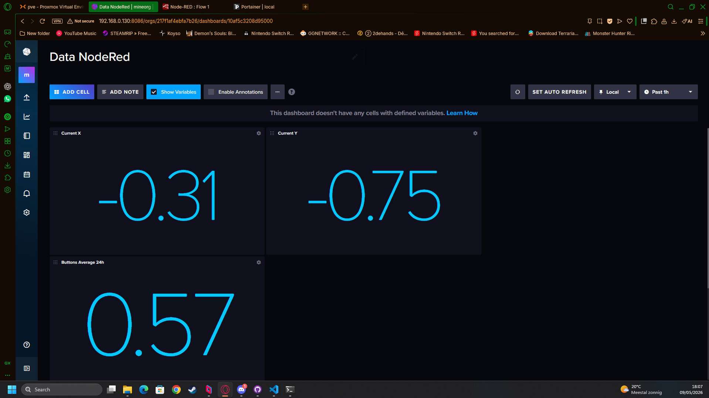
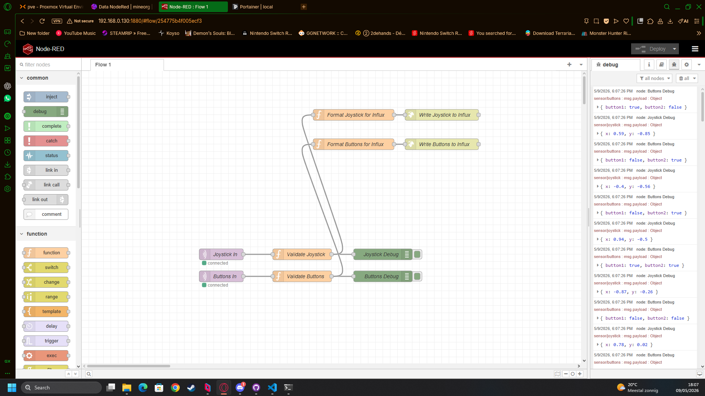
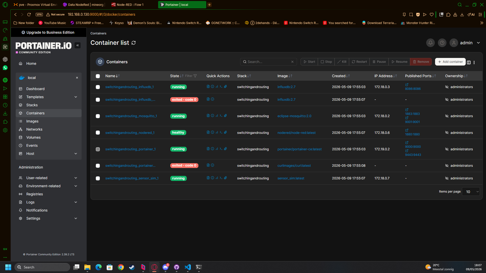

# Smart Sensor Gateway Project

## Overview
This project implements a container-based sensor gateway system that collects data from sensors via MQTT, processes it with Node-RED, stores it in a database, and provides visualization through dashboards. The system is managed using Docker Compose and Portainer.

## Architecture
- **MQTT Broker (Mosquitto)**: Handles sensor data publishing
- **Node-RED**: Processes and routes sensor data
- **InfluxDB**: Time-series database for data storage
- **Grafana/Dashboard**: Visualization of sensor data
- **Portainer**: Container management interface

## Installation
1. Ensure Docker and Docker Compose are installed.
2. Clone this repository.
3. Run `docker-compose up -d --build` to start the services.

## Usage
- Access Node-RED at http://localhost:1880
- Access Portainer at http://localhost:9000 

## Full startup
Maak linux VM

Run through setup, we enable ssh for convience

Complete the setup and reboot

Ssh for ease of use.
Afterwords install docker:

sudo apt update
sudo apt install -y ca-certificates curl gnupg

sudo install -m 0755 -d /etc/apt/keyrings
curl -fsSL https://download.docker.com/linux/ubuntu/gpg | sudo gpg --dearmor -o /etc/apt/keyrings/docker.gpg
sudo chmod a+r /etc/apt/keyrings/docker.gpg

echo \
  "deb [arch=$(dpkg --print-architecture) signed-by=/etc/apt/keyrings/docker.gpg] https://download.docker.com/linux/ubuntu \
  $(. /etc/os-release && echo $VERSION_CODENAME) stable" | \
  sudo tee /etc/apt/sources.list.d/docker.list > /dev/null

sudo apt update
sudo apt install -y docker-ce docker-ce-cli containerd.io docker-buildx-plugin docker-compose-plugin

sudo systemctl enable docker
sudo systemctl start docker

Clone the repo: git clone https://github.com/JollyJones101/ProjectSwitchingAndRouting.git
Go into the dir: cd ProjectSwitchingAndRouting/SwitchingAndRouting
Create an .env file 
Install make: sudo apt install make
Run: sudo make build or docker-compose up

## Team
Jamie Jones
## Deployment
I have also setup a proxmox server at home on which I have setup a VM with ubuntu-24.04.4-live-server-amd64.iso on this VM I installed docker and docker-compose.
As you can see in the screenshots below, we are able to acces all our Containers form my Local Network.

